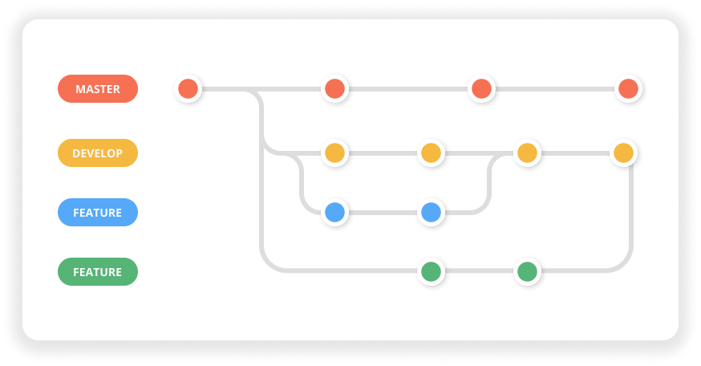
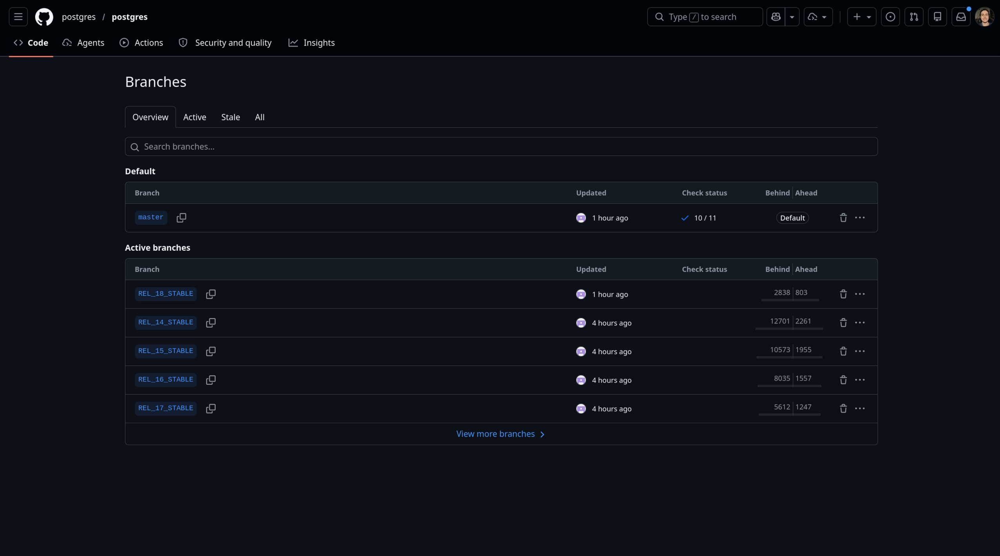

# Branches

O modelo de ramificações é um dos recursos mais diferencia o Git na comunidade de sistemas de versionamento.

    

---
hideInToc: true
transition: slide-left
---

# Branches

## `git branch`

_"List, create, or delete branches"_

Alternativamente:

- `git checkout -b <nome>` para criar e mudar para a branch em um único comando
- `git switch <nome>` para mudar para uma branch existente
- `git switch -c <nome>` para criar e mudar para a branch em um único comando

---
hideInToc: true
transition: slide-left
---

# Branches

## Branches remotas

Ficam no sistema de hospedagem de código.

    

