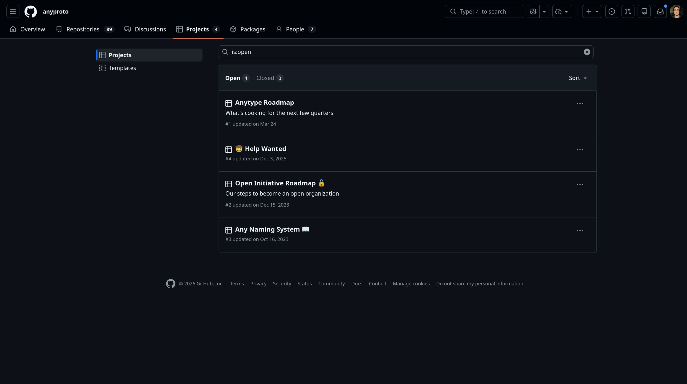

# GitHub Projects

Ferramenta de gerenciamento de projetos integrada ao GitHub, permitindo que equipes organizem e acompanhem o progresso de suas tarefas, bugs e recursos em um formato visual.

    

