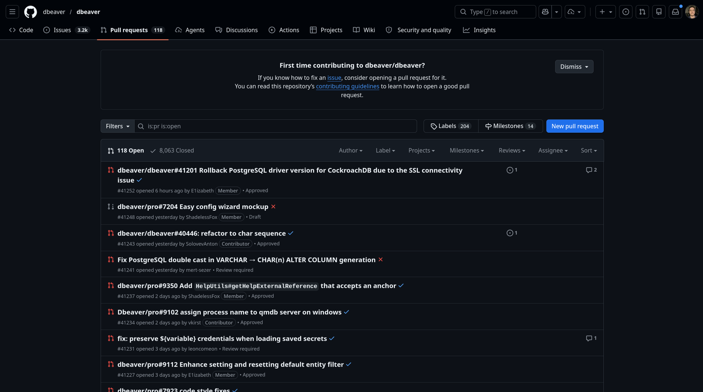
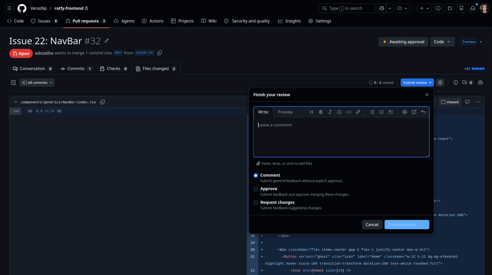

# Pull requests e reviews

## Pull requests

Solicitação de junção de mudanças de uma branch para a outra. Essa ação estará sujeita a revisões, discussões e aprovação por parte dos colaboradores do projeto.

    

---
transition: slide-left
hideInToc: true
---

# Pull requests e reviews

## Reviews

Uma etapa  importante no aceite ou rejeição de um Pull Request. Os revisores podem deixar comentários, solicitar mudanças ou aprovar a PR.

    

